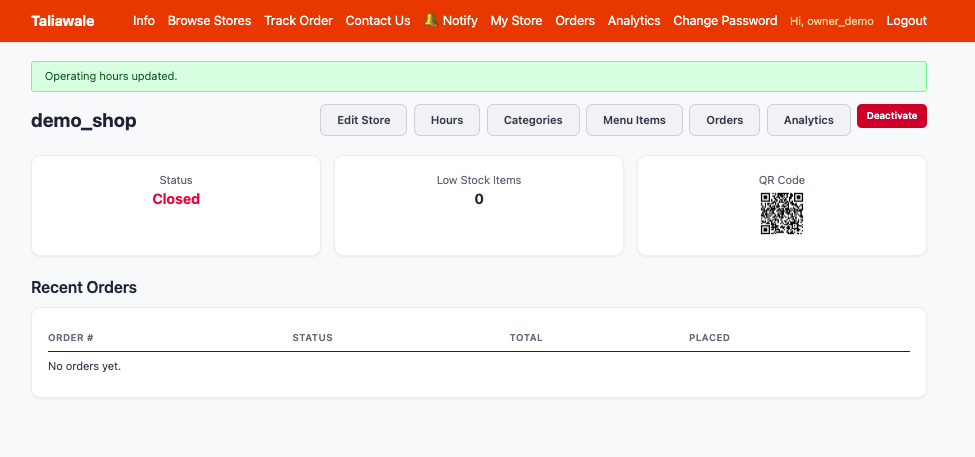

# TaliaWale — Your Online Store Platform | Store Owner

## Key Features

### For Store Owners

- Set up your store with name, category, picture, currency, and operating hours
- Organize products into categories with custom display order
- Set individual tax rates per item (or mark price as tax-included)
- Track stock levels with automatic low-stock alerts
- Receive notifications when new orders come in
- Create orders manually for walk-in or phone customers
- Edit orders — add, remove, or update item quantities
- Merge multiple orders into a single ticket
- Download printable PDF bills for any order
- View sales analytics — daily, weekly, or monthly
- Share your store via WhatsApp, email, or QR code
- Choose your country timezone so operating hours match your local time
- Accept orders even when closed (optional)

### Want to Sell?

If you want to create your own online store:

1. Click **Register Your Stall** in the top menu.
2. Fill in your username, email, phone number, and password.
3. Set up your store — name, category, address, timing, and currency.
4. Add your product categories and items.
5. Start receiving orders!

For detailed step-by-step instructions, see the **[Store Owner Guide](./owner_guide/README.md)**.

 

© 2026 TaliaWale. All rightsreserved.
